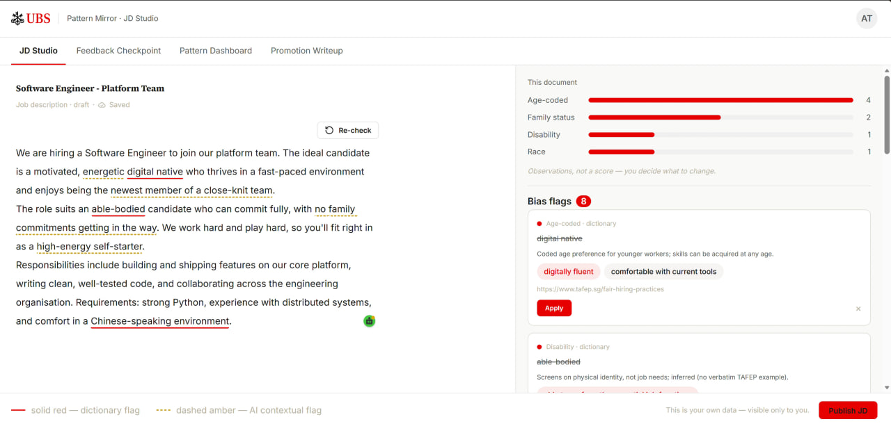
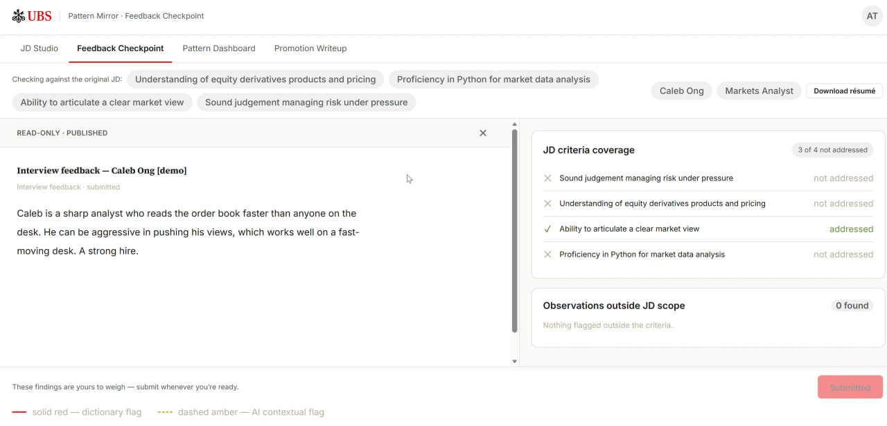
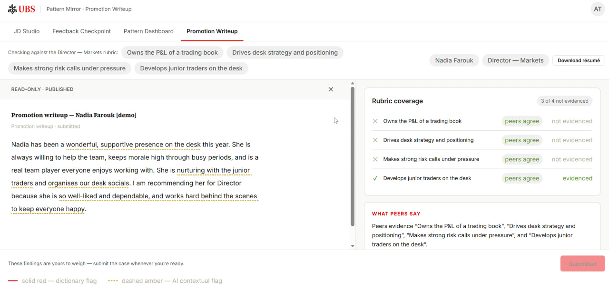
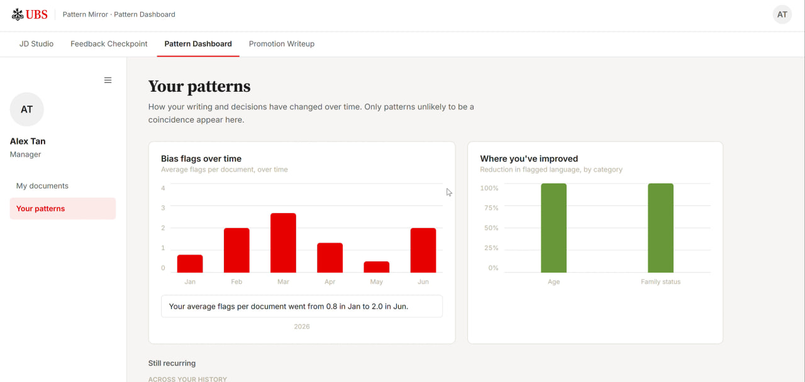
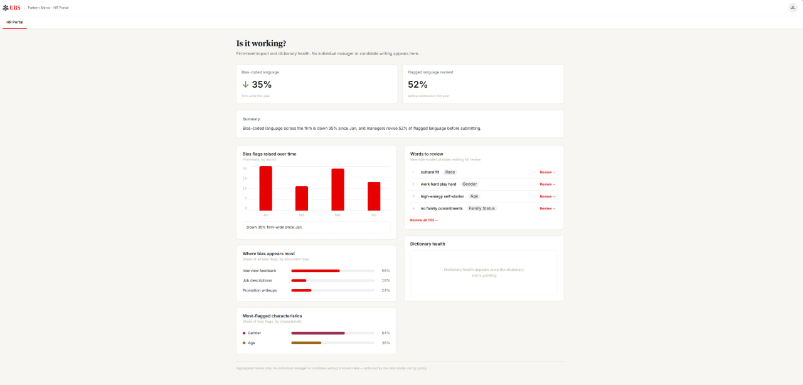
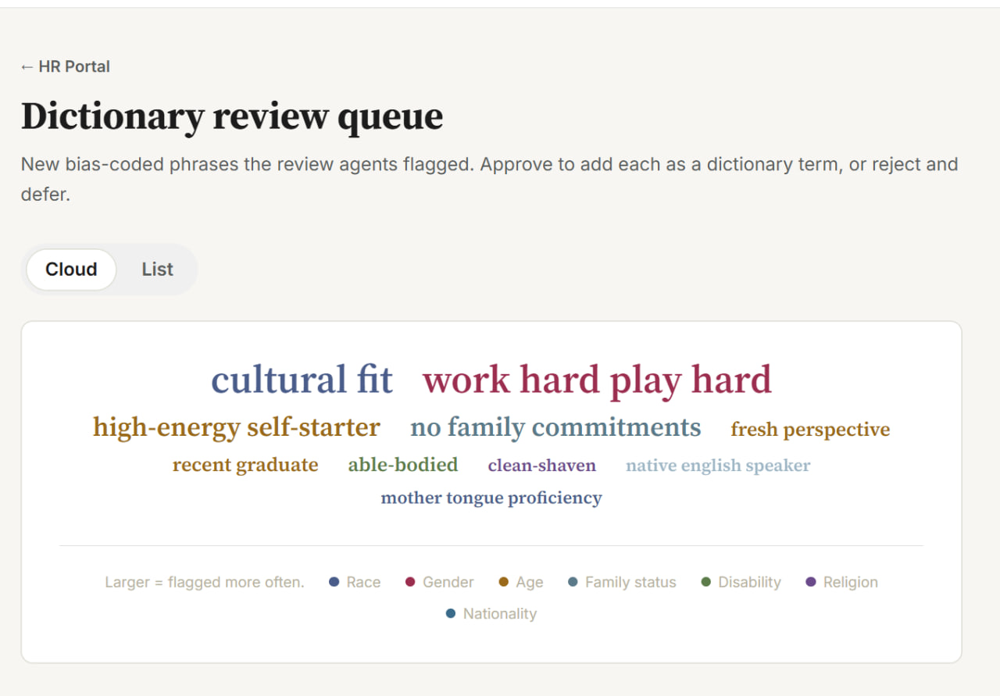

# pattern-mirror

A longitudinal bias-pattern analysis tool for managers — real-time bias flagging in hiring and promotion writing, drift checks against stated criteria, and statistically-gated pattern surfacing across a manager's full body of writing.

Built for the UBS Tomorrow's Talent Programme 2026, Technology Track.

**Status:** in development — MVP targeted at the programme's final showcase (July 2026)

**Portfolio deck:** a walkthrough of the product and the engineering behind it — [docs/pattern-mirror-deck.pdf](docs/pattern-mirror-deck.pdf)

---

## The problem

Unconscious bias in job descriptions, interview feedback, and promotion write-ups filters out qualified candidates and creates regulatory exposure. Each document looks unobjectionable in isolation; the pattern only emerges across a manager's full body of writing — where no existing tool looks. Bias training never shows a manager their own writing, diversity dashboards report outcomes rather than the writing producing them, and single-document checkers flag one word at a time and get dismissed as noise.

Pattern Mirror surfaces the patterns in a manager's own writing, with evidence, and leaves the decision with them.

## What it does

Four views for the manager, all backed by one analysis engine and one database:

| View | What it does |
|---|---|
| **JD Studio** | Write job descriptions with live bias flagging: deterministic flags for established bias phrases, plus an LLM contextual pass that streams in after a typing pause and catches what a dictionary can't — coded language, requirements unrelated to the role. |
| **Feedback Checkpoint** | Pre-submission check on interview feedback: the same bias flagging, plus drift against the criteria stated in the original JD — criteria the feedback never addressed, passages irrelevant to any criterion. |
| **Promotion Writeup** | Pre-submission check on a promotion justification — the manager's written case for promoting an employee: bias flagging plus drift against that employee's historical peer feedback. |
| **Pattern Dashboard** | The longitudinal view: recurring patterns across the manager's writing and their own decisions about flags. Only patterns passing a statistical significance test surface. |

HR Business Partners get a separate portal — aggregates only, never individual manager content:

| View | What it does |
|---|---|
| **Trends Dashboard** | Firm-level aggregated bias trends. Any aggregate covering fewer than three managers is suppressed, so no figure can identify an individual. |
| **Dictionary Review** | The approval queue for proposed dictionary additions: each candidate arrives with the reviewing agents' reasoning and citation; HR approves, rejects, or defers in monthly bulk. |

### A look at the interface

| | |
|---|---|
|  |  |
| **JD Studio** — dictionary flags land instantly; the contextual pass streams in the rest. | **Feedback Checkpoint** — drift against the original JD's criteria, each backed by a verbatim quote. |
|  |  |
| **Promotion Writeup** — rubric coverage set against what the employee's peers actually said. | **Pattern Dashboard** — only patterns that pass a significance test surface. |
|  |  |
| **HR Portal** — aggregate-only firm trends, never individual content. | **Dictionary Review** — proposed phrases as a word cloud, sized by how often each was flagged. |

### Design principles

- **Mirror, not judge.** The tool shows patterns to the manager; it never penalises.
- **Private by architecture.** Individual writing is visible only to the manager; HR sees aggregates only — enforced by the data model, not by policy.
- **Non-blocking.** Every flag is dismissible. The tool never prevents a submission.
- **Evidence for every flag.** Each observation cites peer-reviewed research, legislation-grounded guidance, or the manager's own documented pattern.

## How it works

### Bias detection pipeline

The engine is a bounded flow orchestrated as an explicit state graph — every stage logged, every transition traceable, every flag span-verified:

1. **Dictionary** — deterministic, lemma-aware matching against a curated, citation-backed dictionary. No LLM call.
2. **Contextual Pass** — one schema-enforced LLM call that reads the document in context: it adds the non-literal flags a dictionary can't catch and rules on each dictionary hit in context (acceptable, acceptable with justification, unacceptable).
3. **Adjudicator** — deterministic span verification: any LLM-claimed quote that doesn't exist verbatim in the source is dropped. Hallucinated flags cannot reach the manager.
4. **Judge** — a second, smaller model re-examines each surviving flag against the document text itself, answering a fixed rubric several times; a flag's confidence is the fraction of runs agreeing it's biased. Low-confidence flags terminate here.
5. **Recommendations** — 2–3 evidence-anchored alternative phrasings, only for flags above the confidence threshold.

Between adjudication and judging, flags the manager already dismissed in that document are suppressed — still logged, never resurfaced unless the surrounding sentence changes.

### Drift check

The same engine with a swapped reference corpus: interview feedback is compared against the original JD's criteria, promotion write-ups against historical peer feedback. It names which criteria the writing addressed — each backed by a verbatim, verified quote — and which it didn't.

### Pattern surfacing

Aggregated queries over the manager's flag history, no LLM involved. A pattern surfaces only when Fisher's exact test says it is statistically significant, not merely frequent.

### Dictionary growth

Phrases the Contextual Pass proposes repeatedly across documents become candidates. Four agents review each — Proposer, Skeptic, Categorizer, Citation — and a candidate advances to HR review only with a citation found, a general (not role-specific) scope, and at least one debater in favour. Approved entries land in the dictionary with their citation attached. The dictionary is Singapore-scoped for MVP and region-pluggable by design: the engine is region-agnostic, the dictionary is data.

## Tech stack

| Layer | Choices |
|---|---|
| Frontend | React 19 + TypeScript, Vite, Tailwind CSS v4, TipTap (editor surfaces), TanStack Router + Query; charts are in-house components over the design tokens |
| Backend | Python 3.12, FastAPI, SSE streaming, structlog |
| AI / agents | Anthropic Claude — Sonnet 4.6 (analysis, recommendations, drift), Haiku 4.5 (judge); Instructor for structured outputs; LangGraph orchestration |
| Data | PostgreSQL 16, SQLAlchemy 2.x, Alembic migrations; document text in Postgres, resume binaries in blob storage (local-disk stand-in in dev, Azure Blob in production) |
| Statistics | scipy — Fisher's exact test gating pattern surfacing |
| Quality gates | ruff, mypy --strict, eslint + prettier, pytest + vitest, GitHub Actions CI, SonarCloud |
| Deploy | Docker Compose locally; Azure Container Apps as the production target |

## Getting started

Prerequisites: Docker, Python 3.12 + [uv](https://docs.astral.sh/uv/), Node 22.

```bash
# Postgres (dev + test databases)
docker compose -f deploy/docker-compose.yml up -d

# backend — http://localhost:8000
cd backend
cp .env.example .env          # add ANTHROPIC_API_KEY for the LLM stages (optional)
uv sync
uv run alembic upgrade head
uv run python -m pattern_mirror.jobs.seed_demo
uv run uvicorn pattern_mirror.main:create_app --factory --reload

# frontend — http://localhost:5173, in a second shell
cd frontend
npm install
npm run dev
```

Without an Anthropic API key the deterministic stages still run — dictionary flags work, the LLM stages pass through. Setup details, migrations, and per-service commands: [backend/README.md](backend/README.md) and [frontend/README.md](frontend/README.md).

## Roadmap

- **MVP (programme scope):** the four manager views, the analysis engine with drift checks, the SG-scoped dictionary with the agentic growth loop, the HR portal, and a seeded demo dataset.
- **Post-MVP (design only):** real feedback-system integration (MVP mocks peer feedback as synthetic data), RAG over blob storage for historical retrieval, multi-model gateway, video analysis as a drift reference, a hiring leaderboard, additional region dictionaries. Documented as proposals, not planned builds — see [docs/future.md](docs/future.md).

## Repository layout

```
backend/    Python/FastAPI — engine, agents, API, jobs
frontend/   React/TS — manager portal and HR portal
docs/       Design spec, conventions, ADRs
deploy/     docker-compose and deployment glue
```

## Documentation

- [docs/DESIGN_SPEC.md](docs/DESIGN_SPEC.md) — the product design specification; the product source of truth
- [docs/CONVENTIONS.md](docs/CONVENTIONS.md) — engineering workflow, testing, git, project management
- [docs/CODE_STYLE.md](docs/CODE_STYLE.md) — language-level style rules for Python and TypeScript
- [docs/adr/](docs/adr/) — architecture decision records
- [CLAUDE.md](CLAUDE.md) — collaboration rules for AI-assisted development on this repo

---

Built by Bernice Koh as part of the UBS Tomorrow's Talent Programme 2026, with guidance from a UBS engineering buddy and mentor.
