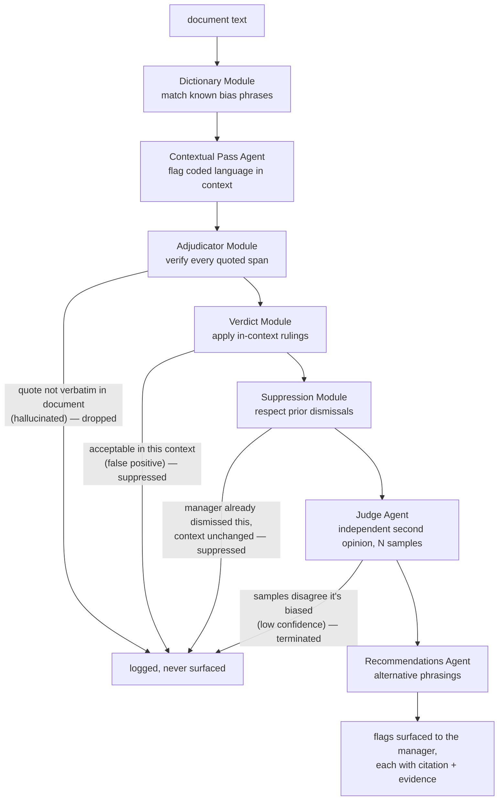
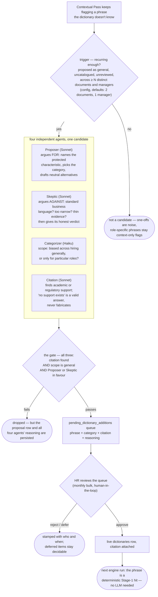

# pattern-mirror

A longitudinal bias-pattern analysis tool for managers: real-time bias flagging in hiring and promotion writing, drift checks against stated criteria, and statistically-gated pattern surfacing across a manager's full body of writing.

[](https://github.com/Bernice-Koh/pattern-mirror/actions/workflows/ci.yml)


[](LICENSE)

> **Portfolio deck — [full walkthrough (PDF)](docs/pattern-mirror-deck.pdf).** The product, the UI, and the research-grounded backend architecture.

Built solo for the UBS Tomorrow's Talent Programme 2026, Technology Track — an applied-AI and full-stack project delivered across a four-week MVP window.

---

## The problem

Unconscious bias persists in hiring decisions, despite the money firms spend on inclusivity training. Managers with hiring authority know the theory, but bias still creeps into the job descriptions, feedback, and promotion writeups they produce — and the tendency only shows across the whole body of writing over time, which no tool reviews.

Pattern Mirror surfaces those patterns in a manager's own writing, with cited evidence — never as a hiring gate. Whether to act on what it shows stays the manager's decision.

## Product overview

Two portals over one analysis engine and one database: four views for managers, and an aggregate-only portal for HR.

**Manager portal — four views:**

- **JD Studio** — write job descriptions with live bias flagging: instant deterministic flags, plus an LLM contextual pass that streams in after a typing pause.
- **Feedback Checkpoint** — pre-submission check on interview feedback, plus drift against the original JD's stated criteria.
- **Promotion Writeup** — pre-submission check on a promotion case, plus drift against the employee's historical peer feedback.
- **Pattern Dashboard** — the longitudinal view: patterns across the manager's writing, surfaced only when statistically significant.

**HR portal — aggregates only, never individual content:**

- **Trends Dashboard** — firm-level bias trends; any aggregate covering fewer than three managers is suppressed, so no figure can identify an individual.
- **Dictionary Review** — the approval queue for proposed dictionary additions, each arriving with the reviewing agents' reasoning and citation.

**Design principles:**

- **Mirror, not judge.** The tool shows patterns to the manager; it never penalises.
- **Private by architecture.** Individual writing is visible only to the manager; HR sees aggregates only — enforced by the data model, not by policy.
- **Non-blocking.** Every flag is dismissible. The tool never prevents a submission.
- **Evidence for every flag.** Each observation cites peer-reviewed research or legislation-grounded guidance.

**Not** a chatbot · **not** a training module · **not** a hiring gate.

> Every view is shown in the [portfolio deck](docs/pattern-mirror-deck.pdf); or [run it locally](#getting-started) to explore the app live.

## Technical design

### Bias detection pipeline

A bounded flow orchestrated as an explicit state graph — every stage logged, every transition traceable, every flag span-verified. A flag reaches the manager only by surviving every gate; the stage name links to its code.

| Stage | What it does |
|---|---|
| [Dictionary](backend/src/pattern_mirror/engine/dictionary.py) | Deterministic, lemma-aware matching against a curated, citation-backed dictionary. No LLM call, milliseconds. |
| [Contextual Pass](backend/src/pattern_mirror/engine/contextual_pass.py) | One schema-enforced LLM call: catches coded, non-literal language not yet in the dictionary, and judges whether each phrase is genuinely acceptable in context — a bona-fide occupational requirement ([GDOR](docs/references/tafep_example_excerpts.md)) or biased. |
| [Adjudicator](backend/src/pattern_mirror/engine/adjudicator.py) | Deterministic span verification: any LLM-claimed quote absent verbatim from the source is dropped. Hallucinated flags cannot reach the manager. |
| [Judge](backend/src/pattern_mirror/engine/judge.py) | A second, smaller model re-examines each surviving flag against the document, answering a fixed rubric several times; confidence is the fraction of runs agreeing it's biased. A [research-grounded](docs/architecture/llm-judge.md) confidence gate — low-confidence flags terminate here. |
| [Recommendations](backend/src/pattern_mirror/engine/recommendations.py) | Two to three evidence-anchored alternative phrasings, only for flags above the confidence threshold. |

Flags the manager already dismissed in a document are suppressed between adjudication and judging. The full graph, including the Verdict and Suppression modules: [architecture/overview.md](docs/architecture/overview.md).

<details>
<summary>Diagram — the bias-detection pipeline</summary>



</details>

### Dictionary growth — the detector improves as it's used

A self-growing fast path: phrases the Contextual Pass keeps flagging across documents become candidates, four agents (Proposer, Skeptic, Categorizer, Citation) debate each, and HR approves what goes live. Nothing enters the dictionary without a citation, a general (not role-specific) scope, and a human sign-off — so wider adoption sharpens detection instead of leaving HR to hand-seed new terms each week. Full design: [dictionary-growth.md](docs/architecture/dictionary-growth.md).

<details>
<summary>Diagram — the dictionary growth loop</summary>



</details>

### Drift check

The same engine run against a reference the writing should match: interview feedback against the JD's stated criteria, a promotion case against the employee's peer feedback. It reports which criteria the writing covered — each backed by a verified verbatim quote — and which it missed.

### Pattern surfacing

Aggregated queries over the manager's flag history, no LLM involved. A tendency is called a pattern only when Fisher's exact test says it is statistically significant, not merely frequent.

## Tech stack

| Layer | Choices |
|---|---|
| Frontend | React 19 + TypeScript, Vite, Tailwind CSS v4, TipTap (editor surfaces), TanStack Router + Query; in-house chart components |
| Backend | Python 3.12, FastAPI, SSE streaming, structlog |
| AI / agents | Anthropic Claude — Sonnet 4.6 (analysis, recommendations, drift), Haiku 4.5 (judge); Instructor for structured outputs; LangGraph orchestration |
| Data | PostgreSQL 16, SQLAlchemy 2.x, Alembic migrations; document text in Postgres, resume binaries in blob storage (local-disk stand-in in dev, Azure Blob in production) |
| Statistics | scipy — Fisher's exact test gating pattern surfacing |
| Quality gates | ruff, mypy --strict, eslint + prettier, pytest + vitest, GitHub Actions CI, SonarCloud |
| Deploy | Docker Compose locally; Azure Container Apps as the production target |

## Getting started

Prerequisites: Docker, Python 3.12 + [uv](https://docs.astral.sh/uv/), Node 22.

```bash
# Postgres (dev + test databases)
docker compose -f deploy/docker-compose.yml up -d

# backend — http://localhost:8000
cd backend
cp .env.example .env          # add ANTHROPIC_API_KEY for the LLM stages (optional)
uv sync
uv run alembic upgrade head
uv run python -m pattern_mirror.jobs.seed_demo
uv run uvicorn pattern_mirror.main:create_app --factory --reload

# frontend — http://localhost:5173, in a second shell
cd frontend
npm install
npm run dev
```

Without an Anthropic API key the deterministic stages still run — dictionary flags work, the LLM stages pass through. Setup details, migrations, and per-service commands: [backend/README.md](backend/README.md) and [frontend/README.md](frontend/README.md).

## Roadmap

- **MVP (programme scope):** the manager and HR portals, the analysis engine with drift checks, the SG-scoped dictionary with its agentic growth loop, and a seeded demo dataset.
- **Post-MVP:** design-only proposals, not planned builds — see [docs/future.md](docs/future.md).

## Repository layout

```
backend/    Python/FastAPI — engine, agents, API, jobs
frontend/   React/TS — manager portal and HR portal
docs/       Design spec, conventions, ADRs
deploy/     docker-compose and deployment glue
```

## Documentation

| Document | What it is |
|---|---|
| [docs/](docs/README.md) | The full documentation index |
| [DESIGN_SPEC.md](docs/DESIGN_SPEC.md) | The product design specification |
| [architecture/overview.md](docs/architecture/overview.md) | Overview of the technical architecture |
| [architecture/llm-judge.md](docs/architecture/llm-judge.md) | The LLM-as-a-Judge design |
| [adr/](docs/adr/) | Architecture decision records — what was decided, when, and why |
| [CONVENTIONS.md](docs/CONVENTIONS.md) | Engineering workflow, testing, git, project management |
| [CODE_STYLE.md](docs/CODE_STYLE.md) | Language-level style rules for Python and TypeScript |
| [CLAUDE.md](CLAUDE.md) | Collaboration rules for AI-assisted development on this repo |

The docs under [docs/architecture/](docs/architecture/overview.md) carry the rendered flow, sequence, and ER diagrams.

---

Built by Bernice Koh as part of the UBS Tomorrow's Talent Programme 2026, with guidance from a UBS engineering buddy and mentor.
