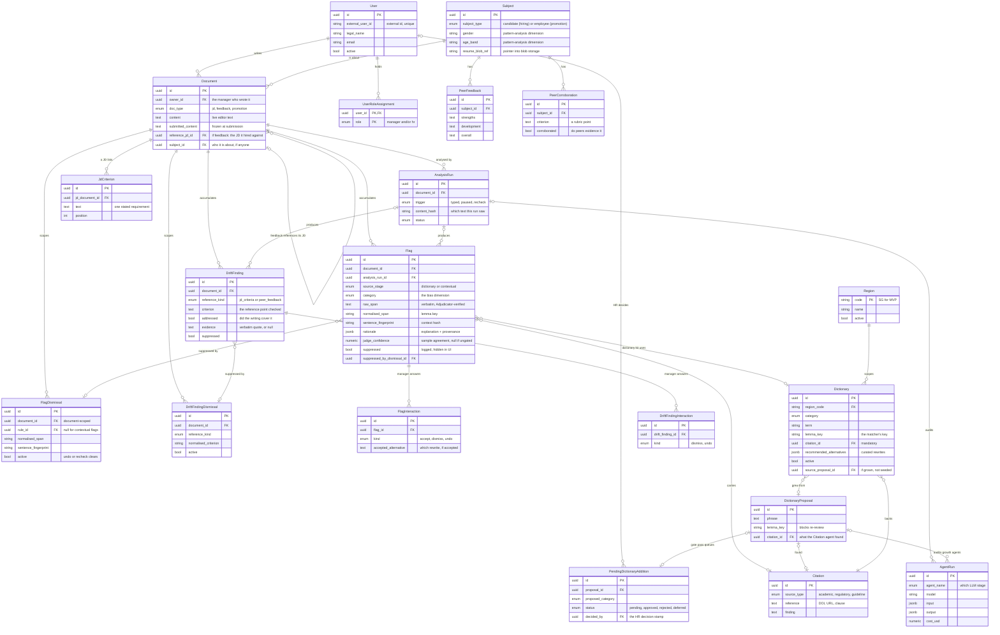

# Data model

The entities that carry the product's promises, and how they relate. This page is a
map, not a schema reference — the schema source of truth is the Alembic migration
history (`backend/src/pattern_mirror/db/migrations/`), and most columns mean what
their names say. Only the non-obvious ones are explained here.

A **flag** is one piece of bias language the engine identified in a document — a
flagged phrase, its category, and its evidence. Most of the model hangs off that idea:
who wrote the document, what the engine found in it, and how the manager responded.

## The entities

Two entities sit outside the graph because nothing references them:
`PromotionRubricCriterion` (a level's promotion rubric, keyed by `level_label` rather
than an FK — a drift reference corpus) and `CalibrationRun` (one gold-set measurement:
agreement, ECE, Brier, per-stage precision/recall — the calibration time series).

## Significant columns

| Column | What it is |
|---|---|
| `Document.owner_id` | The manager who wrote the document. Every manager-facing query filters on this, so a manager sees only their own writing — and HR queries never read below the firm-wide aggregate, so no HR user can ever open an individual manager's write-up. This one column is the privacy boundary ([overview](overview.md#the-privacy-boundary)) |
| `Document.content` vs `submitted_content` | `content` is the live editor text, changing on every autosave. `submitted_content` freezes what the manager actually submitted, so the dashboard can ask "did the flagged phrase survive to the final version?" — the difference between a manager who fixed a flag and one who dismissed it but left the words in |
| `Document.reference_jd_id` | Interview feedback points back at the job description it was written against. That JD's stated criteria are what the drift check measures the feedback against, and what groups feedback documents by role |
| `Flag.raw_span` | The exact biased phrase, copied verbatim from the document and verified to appear in it, so a flag can never quote text the manager didn't write |
| `Flag.normalised_span` + `sentence_fingerprint` | A flag's fingerprint — the lemma-reduced phrase and a hash of its sentence. Stored on the flag so that when the manager dismisses it, the dismissal records the exact same fingerprint the flag had, and a later run can tell "same concern, same context" from "the sentence changed" ([flags-and-suppression.md](flags-and-suppression.md)) |
| `Flag.suppressed` + `suppressed_by_dismissal_id` | A suppressed flag is one the manager already dismissed in this document, or that the engine cleared as fine in context — it is hidden from the manager but kept in the database, because the Pattern Dashboard still needs to count that the phrase came up. `suppressed_by_dismissal_id` records which dismissal hid it |
| `Flag.judge_confidence` — `Numeric(4, 3)` | How sure the Judge is the flag is real, as the fraction of its repeated checks that agreed, to three decimals. `NULL` means the flag skipped the Judge entirely (a deterministic dictionary hit, or no LLM configured) — which is different from `0.0`, meaning the Judge checked and unanimously disagreed |
| `AnalysisRun.content_hash` | The hash of the exact document text a run analysed, so a flag's character offsets still point at the right words even after the manager keeps editing |
| `Dictionary.citation_id` (non-nullable) | Every dictionary entry must cite a real source. The column can't be null, so a biased-term entry with no evidence behind it cannot exist in the first place |
| `Dictionary.lemma_key` (unique with region + category) | One entry per normalised term, per jurisdiction, per bias category — so "young", "younger" and "Young!" can't pile up as separate dictionary rows |
| `UserRoleAssignment` (separate table) | One person can be both a manager and an HR reviewer. Roles live in their own table, and the current session's active role — not the user record — decides which portal they're using and what they can see |
| `FlagInteraction` | Every time the manager responds to a flag we showed them — accepting a suggested rewrite, dismissing the flag, or undoing a dismissal — it is recorded here as its own row. Doing nothing writes no row, so "the manager ignored this flag" is simply the absence of any interaction. This log is how the dashboard knows how a manager actually reacts to the bias it surfaces |

## Blob storage

PostgreSQL holds all text — document content is `Text` columns, deliberately not
blobs, because it is short-form and queried constantly. The only binaries are files:
`Subject.resume_blob_ref` and `User.avatar_blob_ref` are string pointers into blob
storage (local disk in dev, Azure Blob in production, one interface). The engine never
reads blobs.
