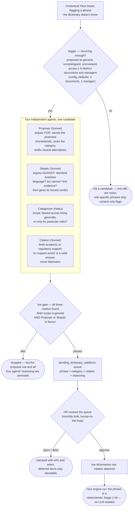

# Dictionary growth

The dictionary is the engine's fast path: a curated list of biased phrases matched
deterministically on every keystroke, each entry carrying a citation. It starts as a
seeded Singapore-scoped lexicon — but managers keep inventing coded language no seed
list anticipates. The growth loop is how the dictionary learns from what the LLM keeps
catching: phrases the Contextual Pass repeatedly flags become candidates, four agents
argue over each, and a human approves anything that goes live. No phrase enters the
dictionary on a model's say-so alone.

## The loop

The batch runs on demand (`python -m pattern_mirror.jobs.growth` — real Anthropic
calls, never in CI): trigger (`services/growth_trigger.py`), review
(`services/dictionary_growth.py`), HR decisions (`services/dictionary_approval.py`,
behind the HR-only `/growth` API).

## Why a debate, not one model call

One model asked "should this join the dictionary?" anchors on its own first impression
— the same failure the engine's Judge stage exists to prevent. The four agents split
the question into parts that check each other, and the gate is deterministic code over
their four validated outputs (`engine/growth/review.py`):

| Agent | Question it owns | Why it can block |
|---|---|---|
| Proposer | The case *for*: category, reasoning, neutral alternatives | Instructed to decline rather than force a weak case — a Proposer that won't argue for it ends the debate unless the Skeptic disagrees |
| Skeptic | The strongest case *against*, then an honest verdict | Catches standard business language and thin evidence |
| Categorizer | `general` vs `role_specific` scope | **Hard gate.** A phrase biased only for certain roles must stay a context-only LLM flag — as a dictionary entry it would false-positive on every other role |
| Citation | A real academic/regulatory source, or none | **Hard gate.** Every dictionary entry cites a source (ADR-0006); an uncited phrase cannot enter, whatever the vote |

So the gate is: **citation found AND general scope AND at least one debater in
favour.** The two hard gates are non-negotiable product promises; the debater
condition asks only that someone, after hearing both sides, still wants it in. A
`votes_in_favour` count (0–4) is recorded for the audit trail but decides nothing.

Note the asymmetry with runtime flagging: the Contextual Pass can flag role-specific
coded language in a document where it applies — that's its job. The growth loop asks a
stricter question: *should this phrase flag deterministically in every document from
now on?* Only generally-biased, citable phrases clear that bar.

## Everything is logged, whatever the outcome

- Every reviewed candidate writes a `dictionary_proposals` row — including candidates
  the gate drops — so "we considered this and said no" is on the record and the
  trigger never re-reviews the same phrase (`already_reviewed` filter).
- Every agent call is recorded to `agent_runs` with its parsed output, tokens, cost,
  and latency, like every other agent in the system.
- Every HR decision stamps who decided and when. Approve materialises the live
  `dictionaries` row; reject is terminal; defer keeps the item decidable next month.

## How phrases are identified

Candidates are grouped by `Flag.normalised_span` — the same lemma key the dismissal
signature uses ([flags-and-suppression.md](flags-and-suppression.md)) — so "Young and
energetic", "young, energetic!" and "younger and energetic" collapse to one candidate
rather than counting toward recurrence as separate phrases. The agents
see a representative surface form plus up to three example sentences from real
documents, giving them usage in context without unbounded prompts.
