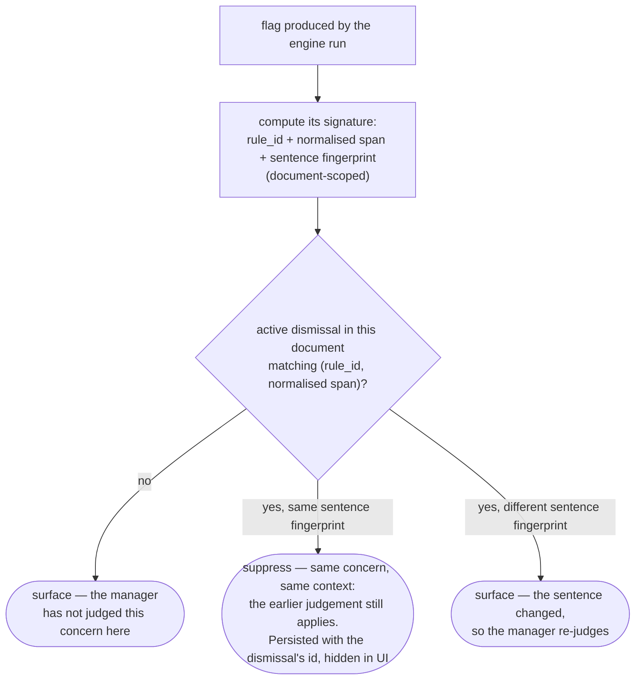

# Flag identity and dismissal suppression

When a manager dismisses a flag, that decision has to stick. The engine re-analyses the
document on every typing pause, and each run regenerates flags from scratch — so without
a durable identity for "the flag the manager already saw", the same word would nag on
every pause, first from the dictionary and again from the LLM. A tool that re-flags a
considered decision gets abandoned; one that never re-flags anything misses the moment
the context around a word changes. This page is how the engine tells those cases apart.

Everything here is deterministic code — no LLM is involved in deciding whether a flag
surfaces again.

## The suppression decision

Made by the Suppression Module (`engine/suppression.py`) for every flag of every run,
after span verification and before judging:

The rule in words: **a dismissal means "I considered this concern, in this context."**
Same concern in the same context — the judgement stands. Same concern in a changed
sentence — the judgement may no longer apply, so the flag returns.

## The signature

A flag's identity is `(document_id, rule_id, normalised_span, sentence_fingerprint)`
— design spec section 12. Each part exists to make one specific failure impossible:

| Component | What it is | What it prevents |
|---|---|---|
| `document_id` | The document the dismissal was made in | A dismissal bleeding across documents: each new JD gets a fresh check, so the Pattern Dashboard can still show "aggressive" recurring across ten JDs even though each one nagged only once |
| `rule_id` | The dictionary rule that fired (`None` for LLM contextual flags) | The dictionary flag and an LLM flag for the same word being treated as one concern |
| `normalised_span` | The flagged phrase reduced to lemmas — lowercased, punctuation dropped, inflection collapsed (`engine/lemmatiser.py`) | Trivial edits reviving a flag: "Aggressive!", "aggressive" and "aggressives" are one span |
| `sentence_fingerprint` | A hash of the containing sentence's *content* (below) | A dismissal outliving its context: change the sentence meaningfully and the flag returns |

## The sentence fingerprint

The context half of the signature (`engine/fingerprint.py`): take the sentence
containing the span, lemmatise it, sort the lemmas (a *bag* — order discarded), hash
the result. Only a change in content words changes the hash:

| The sentence becomes… | Lemma bag | Effect |
|---|---|---|
| "aggressive leader" | `{aggressive, leader}` | — (baseline, dismissed) |
| "aggressive leader." | `{aggressive, leader}` | same hash → stays suppressed |
| "Aggressive Leader" | `{aggressive, leader}` | same hash → stays suppressed |
| "aggressive leaders" | `{aggressive, leader}` | same hash → stays suppressed (lemma) |
| "aggressive go-getter" | `{aggressive, go-getter}` | new hash → flag resurfaces |
| "aggressive, dynamic leader" | `{aggressive, dynamic, leader}` | new hash → flag resurfaces |

Casing, punctuation, inflection, and word order are immaterial; adding or removing a
content word is a context shift. The same lemmatiser produces the dictionary's match
keys, the signature's normalised span, and this fingerprint — one normalisation, three
uses, so they cannot disagree about what "the same word" means.

## The dismissal lifecycle

Where signatures come from and how they are switched off:

- **Dismiss.** The manager dismisses a flag in the UI; `services/interactions.py` logs
  the event (append-only — this log later feeds the adoption metrics) and writes a
  `flag_dismissals` row, copying the signature *straight off the persisted flag* so it
  cannot drift from what the manager actually saw.
- **Undo.** Deactivates the dismissal row. The next run surfaces the flag again.
- **Re-check.** After a major rewrite the manager can ask for a clean pass:
  `POST /documents/{id}/recheck` deactivates *all* of the document's dismissals and
  streams a fresh engine run — every concern, including previously dismissed ones,
  gets re-judged once.
- **Deleted span.** If the manager dismisses a flag and then deletes the phrase in a
  rewrite, the dismissal row simply matches nothing — harmless. Whether the flagged
  language survived to the final text is what separates "dismissed and removed" from
  "dismissed and kept" in the behavioural states (`services/behavioural_states.py`).

## Log everything, suppress only in the UI

A suppressed flag is not a discarded flag. Every flag every run produces is persisted
with full provenance — stage, rule, citation, normalised span, sentence fingerprint,
offsets — plus `suppressed` and the id of the dismissal that suppressed it. The
frontend renders only unsuppressed flags. Three things depend on this:

- The manager sees each concern once per context — the product promise.
- The Pattern Dashboard can still count that a term fired N times in a document the
  manager was only nagged about once — the longitudinal story needs the full log.
- Suppression logic can be revised later without having lost the data it suppressed.

## Known limitation

Sentence boundaries come from punctuation scanning (`.`, `!`, `?`), so an edit that
merges or splits sentences shifts the fingerprint and can resurface a dismissed flag
even though the words around the span didn't change. The spec's recorded fallback, if
real edit traces show this happening in practice, is a fixed N-token window around the
span instead of the containing sentence — less semantically clean, more stable under
editing. Decision deferred until there is data (design spec section 12).
