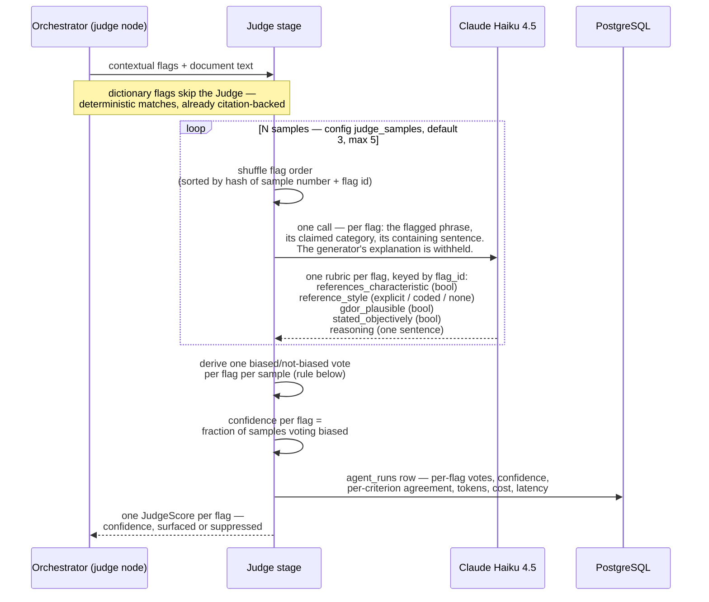
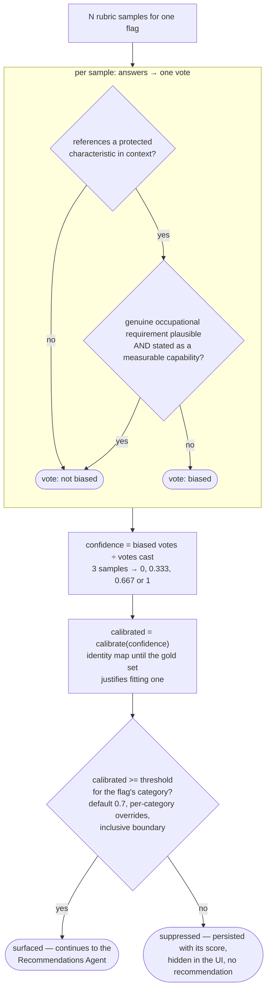

# The LLM Judge

Stage 4 of the analysis engine. Before a bias flag reaches a manager, the Judge gives it
an independent second opinion: a different, smaller model re-examines the flag against
the document text itself and the flag only survives if the Judge consistently agrees it
is biased. The Judge never emits a score — it answers a fixed rubric several times, and
the flag's confidence is how often those answers derive "biased".

Why it exists: the Contextual Pass (Claude Sonnet 4.6) both finds flags and explains
them. Letting the same reasoning grade itself is how false positives survive — a
plausible explanation reads as convincing to the model that wrote it. The Judge is
structured so that its evidence, its model, and its output format are all independent of
the generator it is checking.

**Research grounding:** each of these design choices — a different judge model, rubric decomposition over a scalar score, and self-consistency as the confidence signal — follows published LLM-as-a-judge findings, cited by arXiv id against the decision in [ADR-0013](../adr/0013-judge-context-rubric-self-consistency.md).

## One Judge run

What happens when the engine's judge node executes, end to end:



Details the diagram encodes:

- **The Judge sees the document, not the generator.** Each flag is presented as the
  phrase plus the sentence containing it, cut from the source text
  (`context_window`, `engine/judge.py`). The Contextual Pass's explanation of *why* it
  flagged the phrase is deliberately withheld — the Judge forms its own view from the
  same evidence a human reviewer would get.
- **A different model on purpose.** The Judge runs Haiku 4.5 while the generator runs
  Sonnet 4.6. Same-model judging is the worst self-preference configuration; the sampling
  budget is spent on more samples, not a bigger judge.
- **Shuffled order per sample.** Models favour items by list position. Each sample gets
  an independently shuffled flag order (deterministic — ids sorted by
  `sha256(sample_number:flag_id)`, so runs are reproducible without a PRNG), and rubrics
  are matched back by `flag_id`, not position. A sample that skips a flag degrades to
  one fewer vote for that flag instead of corrupting every verdict after it.

## From rubric answers to surfaced-or-suppressed

The complete decision logic for one flag. No model emits any number here — everything
below the samples is deterministic code (`engine/calibration.py`):



The derivation rule in one line:

```
biased  ⇔  references_characteristic AND NOT (gdor_plausible AND stated_objectively)
```

A phrase is fine to reference a protected characteristic *if* the job genuinely cannot
function without it and the requirement is stated as a measurable capability ("must
lift 15 kg") rather than an identity trait ("young and energetic"). That is the GDOR
test — Genuine and Determining Occupational Requirement — the same standard the
Contextual Pass applies, which is exactly why the Judge re-asks it independently.

## The rubric

Each Judge call fills one schema-enforced rubric per flag (`JudgeRubric`,
`engine/judge.py`; schema violations are retried by the Instructor boundary):

| Field | Type | Question the model answers |
|---|---|---|
| `flag_id` | int | Which flag this rubric answers (order-independent matching) |
| `references_characteristic` | bool | Does the phrase, in context, reference a protected characteristic (gender, age, race, nationality, religion, disability, family status)? |
| `reference_style` | `explicit` / `coded` / `none` | Named outright, implied through proxy language, or not referenced |
| `gdor_plausible` | bool | Could this be a Genuine and Determining Occupational Requirement — the job cannot function without it? |
| `stated_objectively` | bool | Is it stated as a measurable capability or outcome, rather than as an identity trait? |
| `reasoning` | str | One sentence: the deciding observation |

Narrow boolean questions are deliberately the whole interface: a small model answers
"is this stated as a measurable capability?" far more reliably than "rate your
confidence 0–1", and every suppression is explainable after the fact — which criterion
failed, and how consistently, is on the record per flag. `reference_style` and the
per-criterion agreement fractions don't gate anything; they are recorded for the
calibration dashboard.

## Failure modes

Every degradation is downward to "surface more", never to "fail the run" — a missing
judgment must not silently delete a verified flag:

| Condition | Behaviour |
|---|---|
| No Anthropic client configured | Every flag passes ungated (`confidence=None`), stage logs the degrade |
| A sample skips a flag / duplicates a `flag_id` | That flag gets one fewer vote; extra rubrics for the same id within a sample are dropped |
| No sample answered a flag at all | Passes ungated with a warning (`engine.judge_flag_unscored`) |
| Below-threshold confidence | Suppressed: persisted with its score, hidden in the UI, no recommendation — log-everything-suppress-in-UI |

## Measuring it, not trusting it

Confidence-as-agreement is better grounded than a verbalized score, but it is not
guaranteed calibrated — so calibration is measured, never assumed:

- A hand-labelled **gold set** (`jobs/gold_set.py`) is the answer key: documents whose
  correct flags are labelled with span, category, and producing stage.
- `python -m pattern_mirror.jobs.calibrate` runs the **real engine** over the gold set
  (real Anthropic calls — never in CI), pools predictions, and reports per-stage
  precision/recall, **ECE** (expected calibration error) and **Brier score**
  (`services/calibration.py`).
- The calibration map stays the **identity** until those numbers show material
  miscalibration; because the gate reads `calibrate(raw)`, fitting a map later is a
  one-line swap. The gold set is deliberately too small to fit one today —
  measure-before-fit (ADR-0011).

One consequence to keep in mind when tuning: confidence is quantized to multiples of
1/N (N=3 gives 0, ⅓, ⅔, 1), so per-category thresholds only act on that lattice, and
the inclusive `>=` boundary matters.

## Decision history

| ADR | What it decided |
|---|---|
| [ADR-0007](../adr/0007-adjudicator-owns-span-judge-confidence-only.md) | Span existence belongs to the Adjudicator; the Judge owns only the confidence signal |
| [ADR-0008](../adr/0008-confidence-calibration-and-threshold.md) | Calibrated-score gating, per-category config thresholds, inclusive boundary |
| [ADR-0011](../adr/0011-gold-set-demo-split-and-measure-not-fit.md) | Measure calibration on the gold set before fitting any map |
| [ADR-0013](../adr/0013-judge-context-rubric-self-consistency.md) | The current design: document context as evidence, rubric decomposition, self-consistency confidence — and the three defects it fixed |
