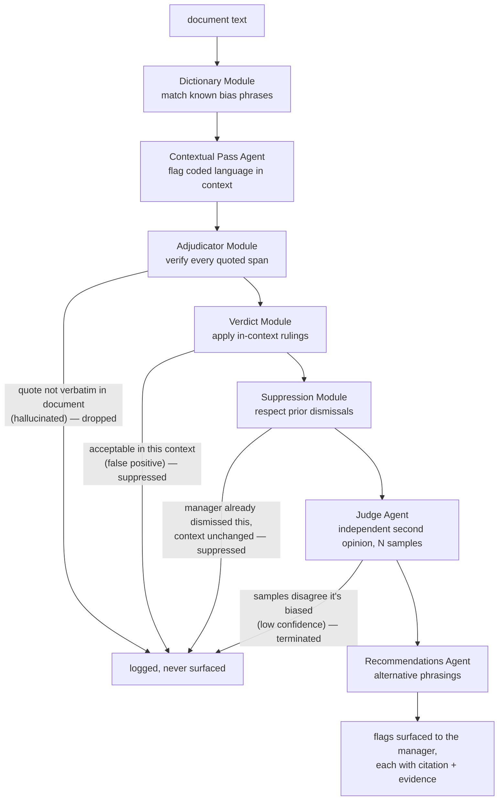
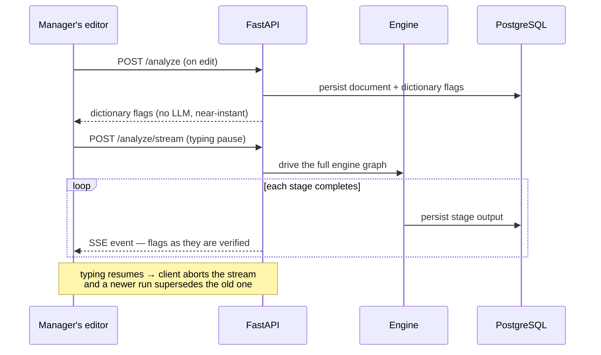

# Architecture overview

The system as built. For product intent see the [design spec](../DESIGN_SPEC.md); for
the decision history see the [ADRs](../adr/).

Pattern Mirror analyses a manager's hiring and promotion writing for bias, live while
they type, and mines the accumulated history for recurring patterns. Everything below
follows from three commitments: managers must be able to trust that their writing stays
private, an LLM's claims must be verified before a manager sees them, and a "pattern"
must be a statistical finding, not an impression.

## Shape

One FastAPI service, one React single-page app, one PostgreSQL database. The backend is
a single package (`backend/src/pattern_mirror/`) split by purpose: `api/` routers stay
thin, `services/` hold the business logic, `engine/` is the analysis pipeline,
`models/` + `db/` the persistence layer, `jobs/` the on-demand entrypoints (demo
seeding, calibration, dictionary growth review).

## The privacy boundary

**The promise: HR can never read an individual manager's writing — not a document, not
a title, not a per-manager statistic.** Managers only use a tool like this if the mirror
is theirs alone; the moment it feeds evaluation, they stop writing honestly in it. So
the product gives HR firm-level insight (is the tool working? is the dictionary
healthy?) while making individual access structurally impossible, not merely forbidden:

- **HR sessions are cut off at the router.** Every HR-facing route lives under `/hr` and
  `/growth`, both wrapped by the `require_hr` role gate (`api/deps.py`); every
  manager-facing route resolves the signed-in user and filters queries by `owner_id`.
  An HR user asking for a manager's document doesn't get "access denied" — the route to
  ask simply does not exist for them.
- **The HR endpoints cannot leak what they never return.** Their response models carry
  only aggregate figures and labels — period, bias category, counts. No document id, no
  owner id, no text. Even a buggy query behind these routes could not expose a manager's
  writing, because the response schema has nowhere to put it.
- **Small aggregates are suppressed before they can identify anyone.** A firm-wide
  figure drawn from few enough managers *is* an individual disclosure (if one manager
  was flagged last month, "the monthly aggregate" is that person). Any aggregate cell
  covering fewer than `hr_min_cell_size` (default 3) distinct managers is dropped
  (`services/hr_aggregates.py`).

The same boundary holds between managers: a document owned by someone else returns 404,
indistinguishable from a document that doesn't exist.

## The engine: trust nothing the LLM says

The analysis pipeline (`engine/orchestrator.py`) mixes LLM calls with deterministic
code. The problem it must solve: an LLM can fabricate — quote text that isn't in the
document, or flag something defensible in context. A manager who sees one fabricated
flag stops trusting every flag. So the pipeline alternates *Agents* (LLM, in italics
below) with *Modules* (deterministic code) that check them, and a flag reaches the
manager only by surviving every gate:

What the split buys:

- **A hallucinated quote cannot reach a manager.** The Adjudicator is code doing a
  string search, not a prompt asking the model to be honest. The drift check gets the
  same treatment: a claimed quote that isn't verbatim in the source is blanked.
- **A second model checks the first.** The Judge (Haiku) re-examines each flag against
  the document text itself — not the Contextual Pass's (Sonnet) explanation — so its
  verdict is independent of the reasoning it is checking. It answers a fixed rubric N
  times; a flag's confidence is the fraction of runs agreeing it's biased. The full
  design: [llm-judge.md](llm-judge.md).
- **Nothing is silently deleted.** Every dropped or suppressed flag is persisted with
  the reason — the audit trail is a product feature (log-everything-suppress-in-UI),
  and the Pattern Dashboard later mines these same rows.
- **The pipeline degrades, it doesn't fail.** Agents are injected; with no Anthropic
  key the LLM stages become passthroughs and dictionary flagging still works. Every LLM
  response is parsed through a schema (Instructor) before any domain object is built,
  and every agent call's inputs, outputs, and cost are recorded.

A **drift check** — same trust rules, different question — runs at the end of the graph
when a reference corpus exists: interview feedback is compared against the original
JD's criteria, promotion write-ups against the employee's historical peer feedback,
naming what the writing addressed (verbatim-verified quotes) and what it ignored.

## The two data paths

**Live — while a manager types.** Feedback must arrive while the sentence is still
being written, but the full engine takes seconds. So two triggers: a fast deterministic
pass on every edit, and the full engine only after the manager pauses.

Persistence is per-stage and committed as the run goes, so flags survive a disconnect
or an aborted stream — the flag log is product data, not a byproduct.

**Longitudinal — when a manager opens the Pattern Dashboard.** No LLM anywhere: the
Pattern Aggregator (`services/pattern_aggregator.py`) reads the persisted flag history,
builds a contingency table per candidate pattern, and surfaces only those passing
Fisher's exact test below the configured threshold (`services/significance.py`). A
manager is never told "you have a pattern" on anecdote — a claim like *"coded terms
cluster in your JDs for senior roles"* surfaces only when the numbers rule out
coincidence. The dashboard also reflects the manager's own decisions back: each flag's
outcome (accepted, edited around, dismissed-and-removed, dismissed-and-kept,
ignored-and-kept) is derived from the interaction log and the final text
(`services/behavioural_states.py`).

HR's reports are a third read shape over the same rows — firm-wide, aggregate-only,
cell-suppressed, as above.

## Persistence

- **PostgreSQL 16** holds everything queryable: documents (text inline), flags with
  full provenance (stage, rule, citation, normalised span, sentence fingerprint,
  offsets), dismissals, interactions, drift findings, the dictionary and its growth
  queue, agent runs, audit. The schema source of truth is the Alembic migration
  history, not the model classes.
- **Blob storage** (local-disk stand-in in dev, Azure Blob in production, one
  interface) holds only resume/CV binaries. The engine never reads blobs.
- Dismissing a flag never deletes it — a dismissal is its own row, matched by a
  document-scoped signature, which is what lets the Suppression Module honour it and
  the dashboard analyse it.

## Configuration

Everything tunable lives in typed settings (`core/config.py`), validated at boot: model
ids per agent, the Judge's confidence threshold and sample count, the pattern
significance threshold, the HR minimum cell size, growth recurrence floors. Models are
config, not code, so swapping one later needs no engine change.
