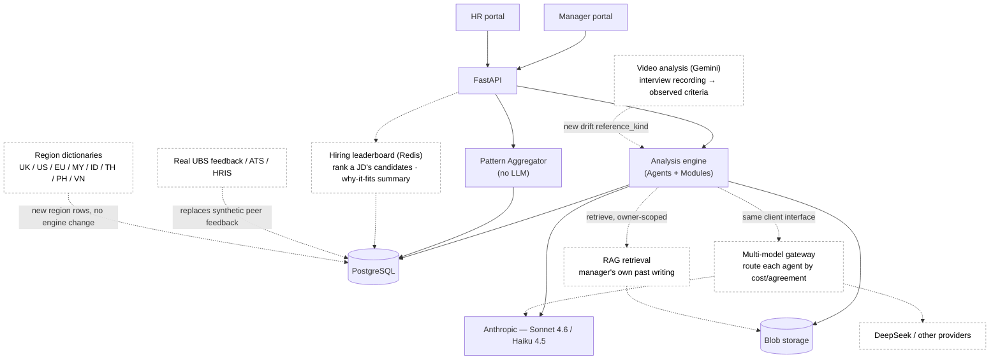

# Future scope

Design proposals for work beyond the MVP. **Nothing here is built or scheduled** — the
repository is expected to freeze at the programme showcase. This page records the
architecture thinking: where each idea would plug in, and what it deliberately leaves
alone.

Each proposal attaches to a real seam already in the codebase — a place the MVP left a
clean edge for exactly this extension. In the diagram, solid-filled boxes are what exists
today; white boxes with dashed borders are the proposed additions.

## The system, with the future bolted on

## The proposals

### Multi-model gateway
Route each agent to a model from any provider, chosen at runtime, instead of Anthropic
throughout. **Seam:** models are already per-agent config (`core/config.py`) behind one
`StructuredCompletionClient` interface (`engine/llm_agent.py`) — the gateway is a second
implementation of an interface that already exists, which is why
[CLAUDE.md](../CLAUDE.md) says not to build the abstraction yet. **Seeded by** an offline
cost/agreement eval over the gold set (Sonnet/Haiku vs DeepSeek), reusing the calibration
approach. **Leaves alone:** the engine, the trust guarantees, and the Judge's
different-model independence ([llm-judge.md](architecture/llm-judge.md)).

### RAG over historical writing
Let an agent retrieve a manager's relevant past documents and reason over them in the
moment, rather than only statistically on the dashboard. **Seam:** documents are already
stored (Postgres + blob), and the flag log is already longitudinal
([data-model.md](architecture/data-model.md)); this adds semantic retrieval on top.
`pgvector` in the existing Postgres is the low-friction option. **Leaves alone:**
retrieval is `owner_id`-scoped like every manager query, and the Adjudicator still
verifies every surfaced span — RAG cannot introduce a quote that isn't there.

### Video analysis as a drift reference
Add the interview recording as a second reference for the Feedback Checkpoint, surfacing
the gap between what happened on camera and what the manager wrote. **Seam:** the drift
check is *already built to swap its reference corpus* (`services/drift_reference.py`), and
`DriftFinding.reference_kind` is already an enum — a video-derived reference is a new value
on an existing axis, not a new engine. The slide names Gemini for native video input.
**Leaves alone:** a video-derived finding still cites the moment it was evidenced, the
same verbatim discipline drift already enforces.

### Hiring leaderboard
For a given JD, rank its candidates with a per-candidate "why this résumé fits the JD"
summary — the differentiator against outcome-only tools. **Seam:** résumés
(`Subject.resume_blob_ref`), JD criteria (`JdCriterion`), and the analysis engine already
exist; this composes them. A Redis cache holds the computed ranking (a genuinely new
datastore, hence future). **Leaves alone:** this is an HR-facing aggregate view, so it
must honour the privacy model — candidate-level, not a window into any manager's writing.

### Region dictionaries
Add jurisdictions beyond Singapore (UK / US / EU / MY / ID / TH / PH / VN). **Seam:** the
engine is region-agnostic and the dictionary is region-scoped *data* — `Dictionary` rows
carry a `region_code` FK and the matcher already loads rules by region
(`load_active_rules(session, region_code)`). A new region is new rows plus a citation set,
with no engine change. The MVP hard-codes `"SG"` in one place (`services/analysis.py`),
which becomes a per-document or per-tenant setting.

### Real feedback integration
Replace the synthetic peer feedback the promotion drift check runs against with the real
UBS system of record, via ATS / HRIS connectors. **Seam:** peer feedback is already an
isolated, read-only reference corpus (`PeerFeedback`, resolved by
`services/drift_reference.py`); the model docstring already notes it is
"synthetic data for the MVP." Swapping the source behind the same read path is the change.
**Leaves alone:** the drift check itself — it consumes a corpus, indifferent to whether
that corpus was seeded or fetched.

## Why these are separate from the architecture docs

The [architecture](architecture/) docs describe the system **as built** — every claim in
them is true of the running code. This page describes systems that **do not exist**.
Keeping them apart is the point: a reader can never mistake an aspiration for a feature.
If any of these is ever built, it graduates to `architecture/` and stops being a proposal.
